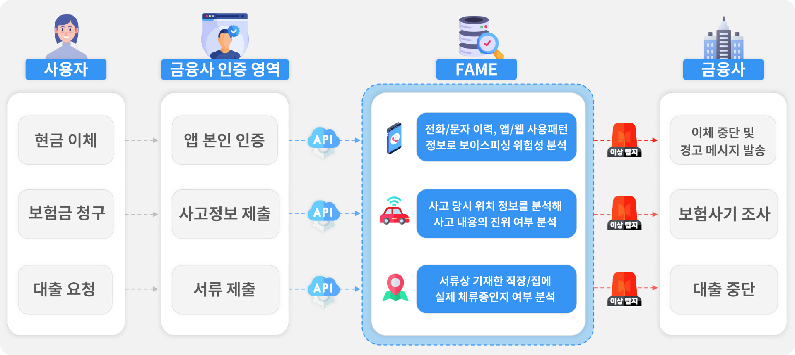
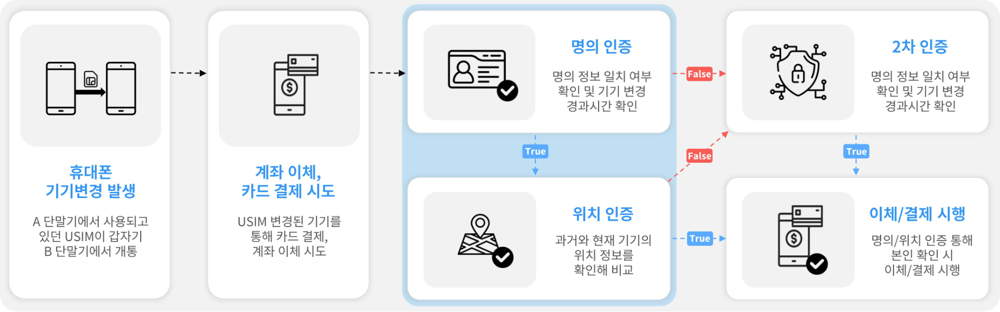

서비스 활용 예시
=====

.. _example:

FAME 서비스는 위와 같은 다양한 시나리오에서 안전한 금융 거래를 위한 특별한 보조 안전망을 제공하고 있습니다. 
각각의 서비스 시나리오에 따라 FAME 의 어떤 기능을 어떻게 활용할 수 있는지 몇 가지 예시를 통해 보여드리도록 하겠습니다. 

보이스 피싱 및 사칭 감지
------------

.. image:: ../img/fame_call.png

FAME 은 대상 고객의 최근 통화 및 메시징 이력을 AI 기술로 분석 합니다. SKT 빅데이터와 AI 분석 모델을 통해 보이스피싱, 스미싱, 사칭 등 범죄에 연관된 SKT 고객을 구분하고 해당 고객과의 통화 및 메시징 이력 여부를 제공합니다. 
금융 서비스 기관은 고객이 금융 서비스를 이용하는 과정에서 FAME 의 해당 기능을 활용하여 부가적인 보안 절차를 도입할지 여부를 결정할 수 있게 됩니다. 

.. http:post:: /api/v1/fame/checkNumbers

   :noindex:
	
	대상 고객의 금융 범죄 연관 대상자와의 통화 및 메시징 기록 여부 제공. 기본 최근 24시간이며 날짜를 지정하여 조회할 수 있습니다. (최근 30일 제한)

   :requestheader Authorization: `token`

**Example Request Body**
.. sourcecode:: json

   {
   	"target_user_id": "string",
	"start_date": "2024-05-03",
	"end_date": "2024-05-03"
   }
     
.. important::
   중요사항 추가.

**Example Request**

.. sourcecode:: bash
  
   curl -s -H "Authorization: {Bearer}" curl -X POST https://skt.fame.com/api/v1/fame/checkNumbers -d '{"user id": {id}}' 

**Example Response** 최근 1주일 간, 금융 범죄 연관 대상자와의 통화 및 메시징 횟수 제공

.. sourcecode:: json

   {
      "user id": "id",
      "abnormal_call_count": 5
   }

기기 및 개인정보 탈취 시도 방지
------------

FAME 은 대상 고객의 최근 통화 및 메시징 이력을 AI 기술로 분석 합니다. SKT 빅데이터와 AI 분석 모델을 통해 보이스피싱, 스미싱, 사칭 등 범죄에 연관된 SKT 고객을 구분하고 해당 고객과의 통화 및 메시징 이력 여부를 제공합니다. 
금융 서비스 기관은 고객이 금융 서비스를 이용하는 과정에서 FAME 의 해당 기능을 활용하여 부가적인 보안 절차를 도입할지 여부를 결정할 수 있게 됩니다. 

.. http:post:: /api/v1/fame/checkNumbers
   :noindex:
	
	대상 고객의 금융 범죄 연관 대상자와의 통화 및 메시징 기록 여부 제공. 기본 최근 24시간이며 날짜를 지정하여 조회할 수 있습니다. (최근 30일 제한)
	 
   :form string: target_user_id (*required*) -- 확인하고자 하는 고객 SKT ID (전화번호)
   :form string: start_date -- 조회 시작 날짜 (명시 안 될 경우 최근 24시간 데이터 제공)
   :form string: end_date -- 조회 종료 날짜 (명시 안 될 경우 최근 24시간 데이터 제공)
   
   :requestheader Authorization: `token`
   
.. important::
   중요사항 추가.

**Example Request**

.. sourcecode:: bash
  
   curl -s -H "Authorization: {Bearer}" curl -X POST https://skt.fame.com/api/v1/fame/checkNumbers -d '{"user id": {id}}' 

**Example Response** 최근 1주일 간, 금융 범죄 연관 대상자와의 통화 및 메시징 횟수 제공

.. sourcecode:: json

   {
      "user id": "id",
      "abnormal_call_count": 5
   }
