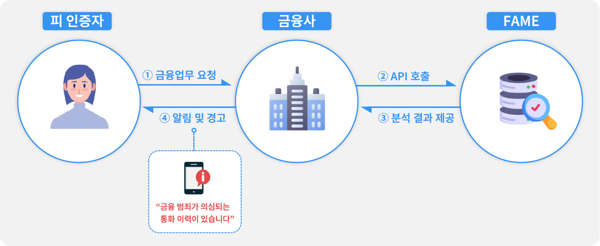

서비스 소개
=====

.. _intro:

**서비스 개요**

FAME (Fraud Detection AI for MNO & Enterprise) 은 SK텔레콤의 빅데이터 및 AI 기술 기반의 금융사고 예방 및 분석 서비스 입니다. 
본 서비스는 기존의 금융사 인증 체계와 더불어 통신사 데이터를 AI 기술을 통해 분석하여 사칭, 보이스피싱, 스미싱, 보험사기, 불법 작업 대출, 보조금 불법 수취등의 다양한 금융 연계 영역에 대한 추가 안전망을 제공합니다.

**문서 목적 및 대상**

본 문서는 FAME 서비스를 활용하고자 하는 금융, 보험 및 추가 보안 안전망이 필요한 개별 기업 고객을 대상으로 합니다. 
대상 고객은 본 문서를 활용하여 고객 주체가 원하는 형태의 맞춤형 솔루션을 구성하고 활용할 수 있습니다. 
